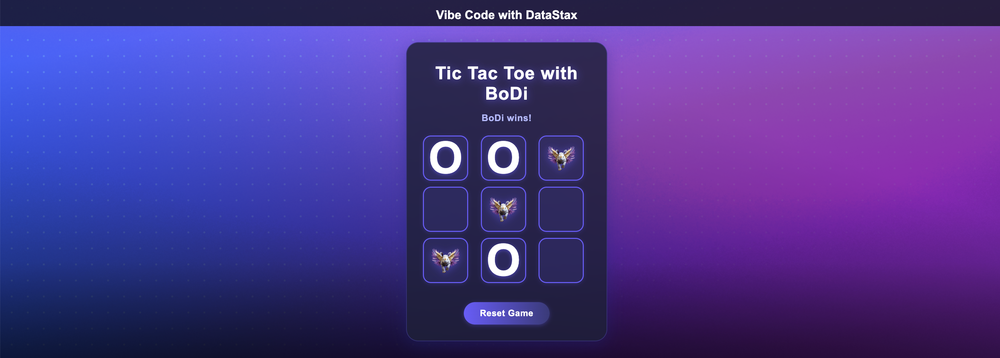

# Tic Tac Toe Web App (Flask)

A modern, responsive Tic Tac Toe game built with Python, Flask, HTML, CSS, and JavaScript. The game features a human vs. computer mode, a confetti celebration on win, and a beautiful UI inspired by modern SaaS landing pages.

---

## Features

- **Human vs. Computer:** Play as 'O' against a computer that always tries to win (using a minimax-inspired strategy).
- **BoDi Branding:** The computer's moves are represented by a custom image (`bodi.png`).
- **Confetti Celebration:** When someone wins, a confetti blast animation appears from the center of the screen.
- **Modern UI:** Inspired by DataStax/IBM landing pages, with a blue-purple gradient, glowing effects, and a top logo bar.
- **Responsive Design:** Works beautifully on desktop and mobile devices.
- **Custom Background:** Uses `background.png` for the page background.
- **Easy Reset:** Instantly start a new game with the reset button.

---

## Demo



---

## Getting Started

### 1. Clone the Repository
```bash
git clone <your-repo-url>
cd <your-repo-directory>
```

### 2. Place Required Assets
- Place your logo as `static/logo.png` (recommended size: 180x40px, transparent background).
- Place your background image as `static/background.png` (large, high-quality image recommended).
- Place your BoDi image as `static/bodi.png` (square, transparent background recommended).

### 3. Install Dependencies
Make sure you have Python 3.8+ and pip installed.
```bash
pip install -r requirements.txt
```

### 4. Run the App
```bash
python app.py
```

### 5. Open in Browser
Go to [http://localhost:5000](http://localhost:5000)

---

## Project Structure

```
├── app.py                # Main Flask application
├── requirements.txt      # Python dependencies
├── README.md             # This file
├── static/
│   ├── style.css         # Main styles
│   ├── confetti.css      # Confetti animation styles
│   ├── script.js         # Game logic (frontend)
│   ├── logo.png          # Your logo
│   ├── background.png    # Page background
│   └── bodi.png          # BoDi image for computer moves
└── templates/
    └── index.html        # Main HTML template
```

---

## Customization

- **Change Computer Image:** Replace `static/bodi.png` with your own image.
- **Change Logo:** Replace `static/logo.png`.
- **Change Background:** Replace `static/background.png`.
- **Colors & Styles:** Edit `static/style.css` for further customization.
- **Confetti:** Tweak `static/confetti.css` and the `createConfetti()` function in `static/script.js` for different effects.

---

## How the Game Works

- The human always plays first as 'O'.
- The computer plays as 'X' (displayed as the BoDi image).
- The computer uses a strategy to always win or force a draw.
- When a player wins, a confetti blast appears.
- The game can be reset at any time.

---

## Troubleshooting

- **Background or images not showing:**
  - Make sure your images are in the `static` directory and named exactly as referenced.
  - Clear your browser cache (Ctrl+Shift+R or Cmd+Shift+R).
- **Flask import errors:**
  - Run `pip install -r requirements.txt` to install dependencies.
- **Port already in use:**
  - Change the port in `app.py` if needed (e.g., `app.run(debug=True, port=5001)`).

---

## Credits

- **Flask:** [https://flask.palletsprojects.com/](https://flask.palletsprojects.com/)
- **Inspiration:** DataStax/IBM landing page design
- **Confetti Animation:** Custom CSS/JS

---

## License

This project is for educational and demonstration purposes. You may use, modify, and share it freely.

---

## Additional Inspiration & Tools

- **AstraDB:** Modern NoSQL database platform, great for scalable and cloud-native applications. Learn more at [https://astra.datastax.com/](https://astra.datastax.com/)
- **Langflow:** Visual programming for LLM applications, enabling rapid prototyping and workflow design. See [https://github.com/logspace-ai/langflow](https://github.com/logspace-ai/langflow)
- **Vibe Coding:** A community and platform for creative coding, rapid prototyping, and sharing innovative projects.

These tools and platforms inspired the design, architecture, and spirit of this project. Consider exploring them for your own advanced AI, data, and coding needs! 